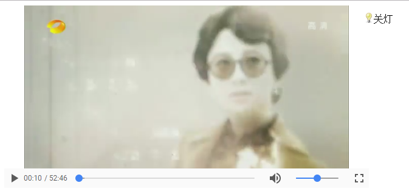

## Html5版VideoPlayer

---

###logo


---

<strong>支持</strong> 双击全屏

<strong>支持</strong> 左右键控制播放进度

<strong>支持</strong> 开关灯控制

<strong>支持</strong> 上下键控制音量

<strong>支持</strong> 空格键控制视频播放

###说明

---

> 配置

>> `isUseBlob` 是否使用blob

>> `vWidth` 控件宽

>> `vHeight` 控件高

>> `vSrc` 视频地址

>> `vZIndex` z-index,默认100

>> `vShowLightSwitch` 是否显示开关灯按钮

>> `vPoster` 视频封面

> 回调

>> `GetInfo` 获取信息

>> `GetVolume` 获取音量

>> `GetCurrentTime` 获取当前播放的时间

> 返回对象

>> `SetCurrentTime` 设置当前播放的时间

>> `SetVolume` 设置音量

>> `SetMuted` 设置静音

>> `SetPause` 设置暂停

>> `SetPlay` 设置播放


### 用法

---

* 引入js 

```javascript
	<script type="text/javascript" src="Html5VideoPlayer.min.js"></script>
```

* 设置配置

```javascript
	var html5VideoPlayer = new Html5VideoPlayer(
		{
			vSrc:"视频地址",
		});
```

* 设置回调

```javascript
	html5VideoPlayer.CallBack(
		{
			//回调方法
		});
```

* Create控件

```javascript
	hvp = html5VideoPlayer.Create('.videoClass');
	//控件方法
	hvp.SetCurrentTime(10);
	hvp.SetVolume(0.5);
```

* demo

```javascript
	var html5VideoPlayer = new Html5VideoPlayer(
		{
			isUseBlob:true,
			vZIndex:100,
			vWidth:600,
			vHeight:300,
			vSrc:"http://xxxx.com/xxx.mp4",
		});
	var hvp = null;
	html5VideoPlayer.CallBack(
		{
			//回调方法的this是一个回调返回对象
			play:function()
			{
				//回调获取信息demo:播放视频时获取音量
				console.log(this.GetVolume());
				//联动demo:播放视频时静音
				hvp.SetMuted();
			},
		});
	hvp = html5VideoPlayer.Create('.videoClass');
	hvp.SetCurrentTime(10);
	hvp.SetVolume(0.5);
	//hvp.SetMuted();
```

[点击查看demo](http://zhusaidong.github.io/Html5VideoPlayer_demo)

* 截图



### 更新

---

2016-10-14 <strong>添加</strong> 项目logo

2016-10-14 <strong>添加</strong> 上下键控制音量

2016-10-14 <strong>添加</strong> 视频封面

2016-10-14 <strong>添加</strong> 空格键控制视频播放

2017-04-24 <strong>添加</strong> 使用blob功能

### TODO

---

自定义播放控制器


### 其它

---

zhusaidong@vip.qq.com
